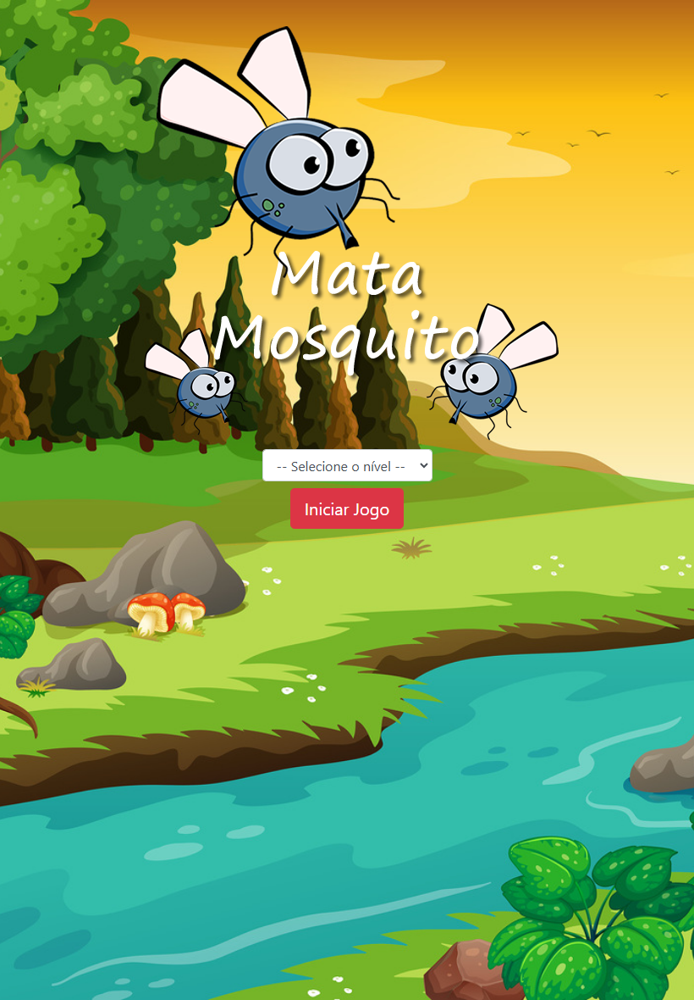

# Bem-vindo ao Mata Mosquito! 🦟

Este é um README interativo para te guiar pelo nosso jogo de reflexos rápidos e diversão garantida.

## Sobre o Jogo 🕹️

Mata Mosquito é um jogo de ação simples, mas desafiador, onde seu objetivo é eliminar o máximo de mosquitos que conseguir antes que o tempo acabe. A cada mosquito que você não consegue eliminar, uma vida é perdida. Mas não desanime, mostre que você consegue!

## Como Jogar 🎮

1. **Seleção de Nível:** Escolha o nível de dificuldade antes de iniciar:
   - [x] **Normal:** Uma dificuldade equilibrada para todos os jogadores, com um tempo de resposta de 1,5s entre mosquitos.
   - [ ] **Difícil:** Um desafio para quem busca mais emoção, com tempo de resposta de 1s.
   - [ ] **Chuck Norris:** A dificuldade máxima para os mais corajosos, com um tempo de resposta menor que 1s!!!

2.  **Iniciando o Jogo:** Após escolher o nível, clique no botão abaixo:

   

3. **Controles:**
   - [x] **Clicar no mosquito:**  Clique no mosquito para eliminá-lo.
   - [ ] **Tempo:** O jogo termina quando o tempo chegar a zero.
   - [ ] **Vidas:** Você começa com 3 vidas. Se deixar 3 mosquitos escaparem, o jogo acaba.

## Tecnologias Utilizadas ⚙️

Este jogo foi desenvolvido com:

- HTML5, CSS3 e JavaScript para a estrutura, estilos e lógica do jogo.
- Bootstrap para um layout responsivo e fácil de usar em diferentes dispositivos.

## Código Fonte 💻

Para ver o código-fonte do jogo e contribuir, acesse: [https://domisnnet.github.io/app-mata-mosquito/]

## Créditos 📝

- Desenvolvedores: [DomisDev]
- Imagens: Imagens criadas para o projeto.
- Bibliotecas e Fontes: Bootstrap para estilo e componentes responsivos.

## FAQ 🤔

**Pergunta 1:** Como eu reinicio o jogo?

   **Resposta:** Após o fim de jogo, clique no botão "Reiniciar" para começar novamente.
    
**Pergunta 2:** O que acontece se eu não clicar em um mosquito?

   **Resposta:** Uma vida é perdida a cada mosquito que escapar, e quando você perde 3 vidas, o jogo acaba.

**Pergunta 3:** Como funciona o cronômetro do jogo?

   **Resposta:** O jogo tem um cronômetro regressivo de 15 segundos. Ao final do tempo, o jogo termina.

## Comece a Jogar! 🚀

Escolha um nível acima e prepare-se para a ação:

---

Divirta-se muito eliminando esses mosquitos! 🎉
