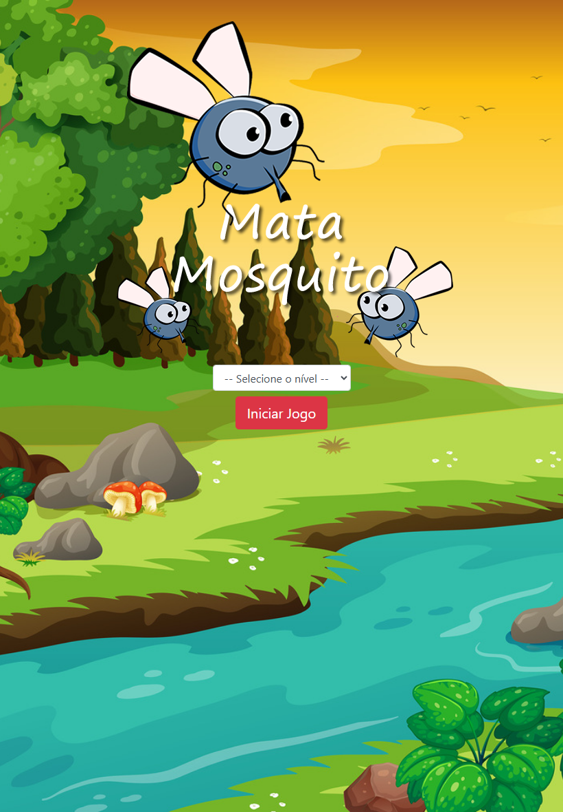

# Bem-vindo ao Mata Mosquito! 

Prepare-se para testar seus reflexos neste divertido e desafiador jogo de ação!

## Sobre o Jogo 🕹️

Em **Mata Mosquito**, seu objetivo é simples: eliminar o máximo de mosquitos que conseguir antes que o tempo acabe. Mas cuidado! A cada mosquito que escapar, você perde uma vida. Não deixe os mosquitos vencerem!

## Como Jogar 🎮

1. **Seleção de Nível:** Escolha a dificuldade que melhor se adequa ao seu desafio:

    - [x] **Normal:** Ideal para todos os jogadores, com mosquitos surgindo a cada 1.5 segundos.
    - [ ] **Difícil:** Um desafio maior, com mosquitos mais rápidos, surgindo a cada 1 segundo.
    - [ ] **Chuck Norris:** Para os mais corajosos! Mosquitos rápidos como um raio, surgindo em menos de 1 segundo.

2.  **Iniciando o Jogo:** Selecione um nível e clique no botão abaixo para começar:

3. **Controles:**
    - [x] **Clique nos Mosquitos:**  Use o clique do mouse para eliminar os mosquitos que surgem na tela.
    - [ ] **Tempo:** A partida termina quando o tempo se esgota (15 segundos).
    - [ ] **Vidas:** Você começa com 3 vidas. A cada mosquito perdido, uma vida é reduzida. Ao perder as três vidas, o jogo acaba.

## Tecnologias Utilizadas ⚙️

Este jogo foi desenvolvido usando:

- **HTML5**, **CSS3** e **JavaScript**: Para a estrutura, estilo e lógica do jogo.
- **Bootstrap**: Para um layout responsivo e adaptável a diferentes dispositivos.

## Código Fonte 💻

Gostou do jogo? Para ver o código-fonte e contribuir com o projeto, acesse:

[Repositório do Mata Mosquito](https://domisnnet.github.io/app-mata-mosquito/)

## Créditos 📝

- **Desenvolvedor:** DomisDev
- **Imagens:** Criadas especificamente para este projeto.
- **Bibliotecas:** Bootstrap para os estilos e componentes responsivos.

## FAQ 🤔

**Pergunta 1:** Como faço para reiniciar o jogo?

   **Resposta:** Ao final da partida, clique no botão "Reiniciar" para começar novamente com a dificuldade desejada.

**Pergunta 2:** O que acontece se eu deixar um mosquito escapar?

   **Resposta:** Você perde uma vida. Ao perder todas as três vidas, o jogo termina.

**Pergunta 3:** Qual a duração do jogo?

   **Resposta:** Cada partida tem a duração de 15 segundos.

## Comece a Jogar! 🚀

Escolha um nível acima e prepare-se para a ação!

---

Divirta-se eliminando todos os mosquitos! 🎉